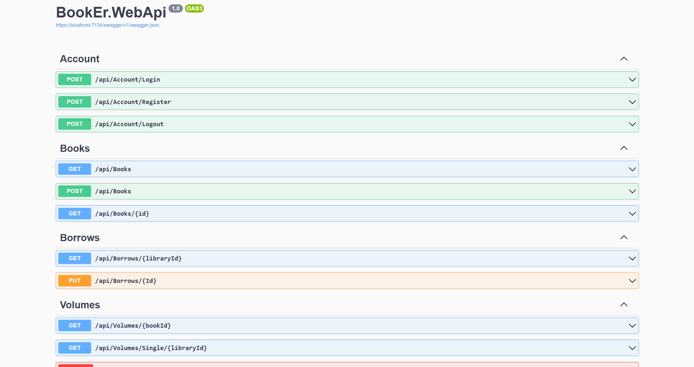
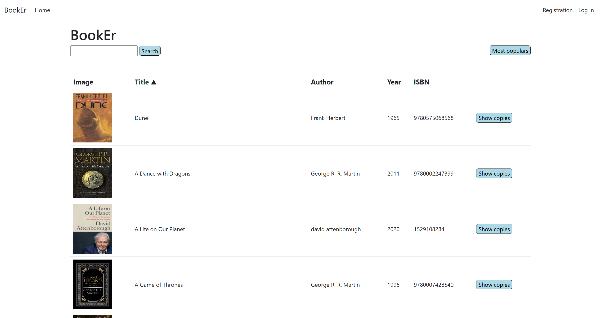
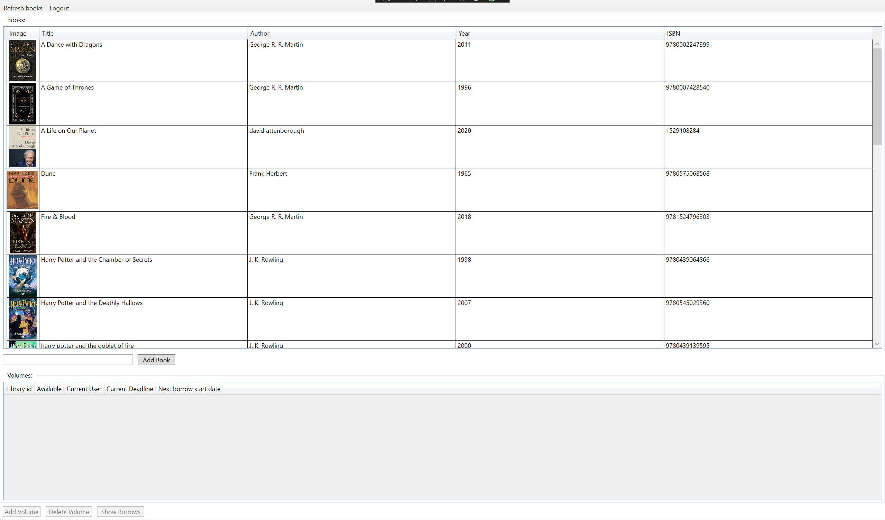
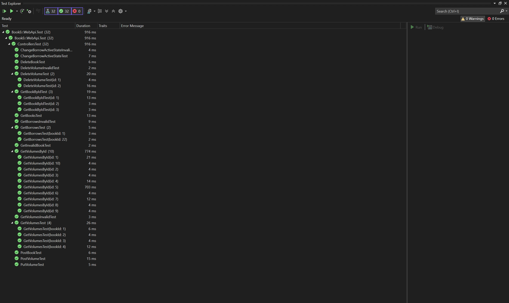

# BookEr 
### A demo library management application made in ASP .NET.

The project contains a WebApi and two client applications (ASP .NET Web app & WPF Desktop app)

This project was made as a homework for the "Web application development" course at ELTE.

## What's this application about
The main task of the application is to assist in managing book loans in a library system. After registration, the users can loan books through the web application. The desktop application is mainly for the librarians to manage the supply of books. Both of these client applications are communicating with the WebApi to acces the **local** database (*Only after authentication & authorization*).

## Technologies used
 - .NET 6.0 (ASP .NET)
 - WPF
 - MSSQL
 - EntityFramework
 - XUnit

## Components
The application consists of 3 main components:
 - WebApi
 - Desktop client
 - Web client

 In addition, the database abstraction (persistence layer) and Unit testing components can also be found in separate VS projects.

 ### WebApi
 Provides acces to the database by defining HTTP endpoints. This component is also responsible for authentication&authorization.

 Also provides a swaggerUI page to test endpoints.

 ### Web client
 The general users can interact with the application through this component.

The user can:
- View the available books ordered by popularity (number of previous loans) by default.
- Order the list of books by title or popularity.
- Search books by title.
- Check the available copies of books.
- Register/Login.
- Request a loan for a specific copy of a book after logging in.

### WPF Desktop client
An application written in MVVM architecture for the librarians to manage loans and books.

The librarians first have to login before doing anything else.

After login, the librarians can:
- View available books and copies.
- Add a new copy to a book.
- Add a new book to the library.
- Remove a copy or book from the library.
- Change an active loan to inactive (book was returned)
- Change an inactive loan to active

### Unit test project
A project containing unit tests for each controller defined endpoint using a mocked in-memory database.

### How to build
- Clone and open the project in visual studio.
- Specify a connection string to you local database in the appsettings.json file located in the BookEr.persistence component.
- Build and run the components in the editor.

## Documentation

If you wish to know more about the details of the implementation of the project (including UML diagrams), check out the [Hungarian Documentation](./Documentation/doc_hun.pdf).

